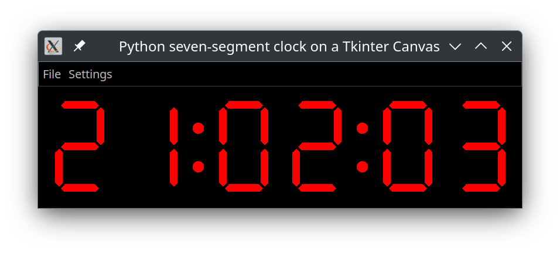

# 7_segment_display
this repository contains Python applicatons which use seven segement displays which are dranw on a tkinter canvas

7segment_clock.py

Copyright 2025 Nap0

This program is free software; you can redistribute it and/or modify
it under the terms of the GNU General Public License as published by
the Free Software Foundation; either version 2 of the License, or
(at your option) any later version.

This program is distributed in the hope that it will be useful,
but WITHOUT ANY WARRANTY; without even the implied warranty of
MERCHANTABILITY or FITNESS FOR A PARTICULAR PURPOSE.  See the
GNU General Public License for more details.

You should have received a copy of the GNU General Public License
along with this program; if not, write to the Free Software
Foundation, Inc., 51 Franklin Street, Fifth Floor, Boston,
MA 02110-1301, USA.

This Python code implements a digital clock with vintage looking seven segment display
the seven segment display is drawn once a Tkinter canvas, the digits are then updated
by switching their visibility on and off appropriately the logic for switching the segments
in function of the character to be displayed is kept in a dictionary with the character als key
and seven booleans representing the state of the seven segements for that character

