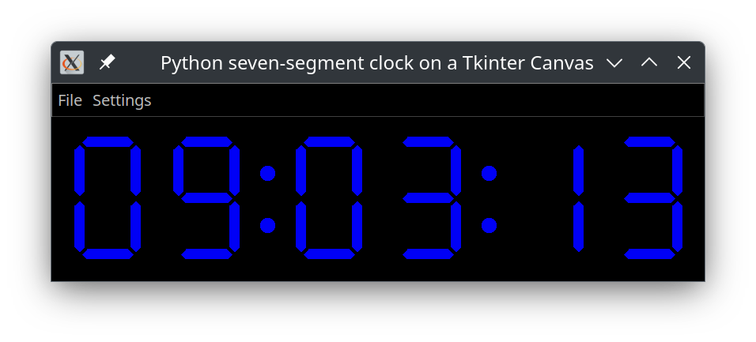

# 7_segment_display
this repository contains Python applicatons which use seven segment displays which are drawn on a tkinter canvas

7segment_clock.py

This Python code implements a digital clock with vintage looking seven segment display
the seven segment display is drawn once a Tkinter canvas, the digits are then updated
by switching their visibility on and off appropriately the logic for switching the segments
in function of the character to be displayed is kept in a dictionary with the character als key
and seven booleans representing the state of the seven segements for that character

